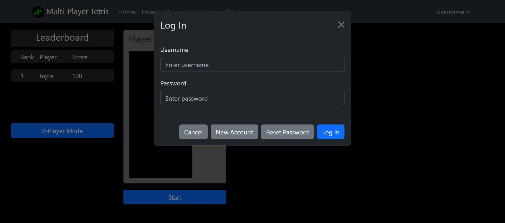
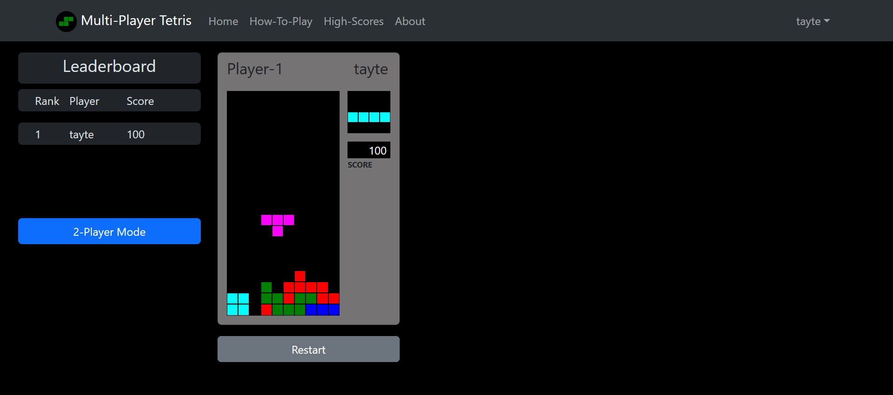
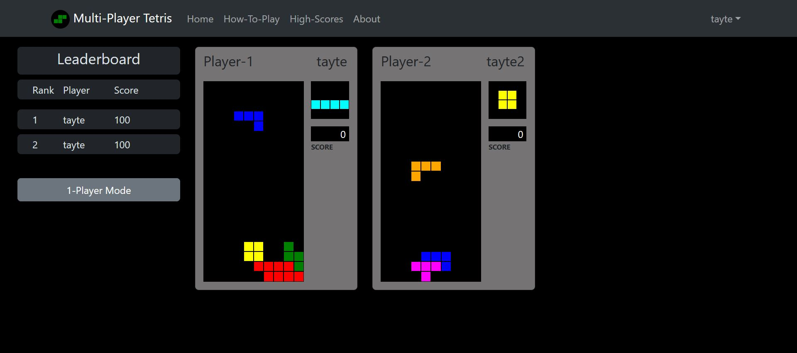
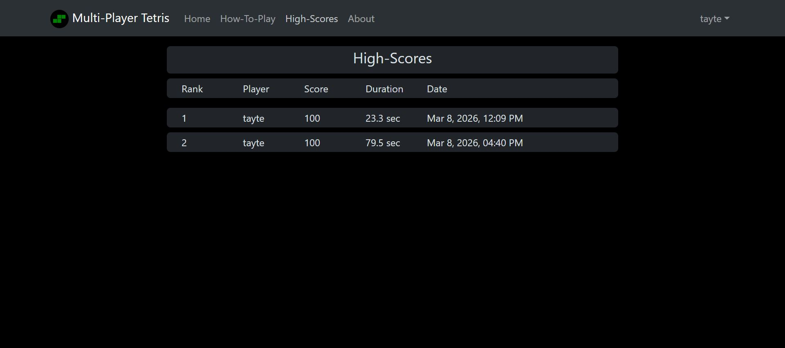

# CS565-Final-Project

## About

The following repository contains the implementation and documentation for the Portland State University CS565 final project. It implements a browser-based multi-player [TETRIS](https://en.wikipedia.org/wiki/Tetris) game, in which two players are able to compete against one-another in real-time. It is used to explore and demonstrate frontend and backend web technologies.

A journal of the design process, decisions, and major commits/branches is retained within this codebase in [`docs/journal.md`](./docs/journal.md)

The live site can be accessed running on the public url: [cs565-final-project-tayte-waterman.com](http://cs565-final-project-tayte-waterman.com)

### Author

Tayte Waterman
[watermanpdx](https://github.com/watermanpdx), [TayticusPrime](https://github.com/watermanpdx)
[Portland State University](https://www.pdx.edu/) (Student)
CS656 - Full Stack Web Development
Winter 2026

## Usage

### Remote (Live) Access

Access via: [cs565-final-project-tayte-waterman.com](http://cs565-final-project-tayte-waterman.com)

### Local Execution

The webpage can be run in a local environment via `Docker Compose` to orchestrate both the backend server and `PostgreSQL` database. First install a `Docker` runtime environment on your local machine ([Install Docker](https://docs.docker.com/get-started/get-docker/)). Once installed the user only needs to call `Docker Compose`. From the root project directory execute the following commands:

```bash
docker compose up --build
```

This will fetch and build the dependent docker containers, (within then) install all necessary `npm` dependencies, and start the backend and `PostgreSQL` processes, and expose the backend server port. The webpage can then be accessed via local browser at: [localhost](http://localhost/)

### Login

On initial page-load, the user will be prompted to log-in. Log-in is mandatory in order to manage player scores.



### How to Play

Instructions on how to play can be accessed via the "How-to-play" link in the Navbar. During both the 1-player and 2-player modes, the Tetris game is controlled via the keyboard:

#### Controls

- **Move Left** - A, Left-Arrow
- **Move Right** - D, Right-Arrow
- **Move Down** - S, Down-Arrow
- **Rotate Left** - Q
- **Rotate Right** - E, Space-Bar

### 1-Player Mode

1. Select "1-Player" mode on the main-page.
2. Click the "Start" button below the game-area to begin playing.
3. Use the keyboard to control the Tetris game. Controls informatoin can be found in the "How to Play" link in the navigation banner.
4. On game-end (assuming non-zero score) the player username and score can be seen in the "Leaderboard" page, or in the main-page summary if in the top high-scores.



### 2-Player Mode

1. Select "2-Player" mode on the main-page.
2. Click the "Start" button below the game-area to start a game. It will not start until a second player is available.
3. In another tab, reopen web-page [localhost](http://localhost) and log-in.
4. Repleat steps 1 and 2 from the new tab.
5. A 2-player game will start in real-time for both participants.
6. On game-end (both players) the player username and score will be added to the "Leaderboard" page, or in the main-page summary if in the top high-scores.



### High-Scores

Click on the "High-Scores" link in the Navbar at the top of the sign to get to see a list of high-scores from all players.


